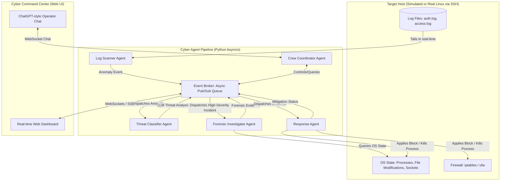

# Technical Architecture & Build Guide: Cyber Agent

Welcome to **Cyber Agent**, an industry-standard, multi-agent automated incident response platform. This guide explains the entire architecture, tech stack, data flows, and scalability considerations so you can confidently explain the project in interviews, to stakeholders, or write about it in your portfolio.

---

## 1. Executive Summary & Problem Space

In modern cybersecurity, **Mean Time to Detect (MTTD)** and **Mean Time to Respond (MTTR)** are the most critical metrics. When a server is compromised (e.g., via a brute-force SSH attack or a web shell upload), it takes a human security team an average of **hours** to detect the anomaly, investigate the logs, locate the source, and apply firewalls. By then, data exfiltration or system takeover has already occurred.

**Cyber Agent** solves this by connecting a crew of specialized AI agents into an asynchronous, event-driven security pipeline. It reduces incident response time from hours to **seconds**.

---

## 2. Core Architecture

The system is designed around **three core principles**:
1. **Decoupling**: The agents do not call each other directly. Instead, they communicate using an **Asynchronous Pub/Sub Event Broker**. This makes the system scalable, thread-safe, and ready to be distributed across microservices.
2. **Adapter Pattern**: The agent crew interacts with target servers through a unified `ServerAdapter`. This allows us to run in **Simulator Mode** (for instant demos on any OS without setup) or **Live Server Mode** (connecting to actual Linux production servers via SSH/Paramiko).
3. **Structured Orchestration**: We use standard Python async/await patterns for low-latency log tailing and streaming, coupled with structured Gemini LLM reasoning for classification and intent routing.

---

## 3. The Tech Stack & Rationale

| Technology | Role | Rationale |
| :--- | :--- | :--- |
| **Python (3.11+)** | Core backend language | Industry standard for cybersecurity scripting, AI/ML, and agentic workflows. |
| **FastAPI** | Web Framework | Built on Starlette and Pydantic, it supports native asynchronous operations, making it extremely fast. Native WebSocket support allows us to stream logs and agent events in real-time to the dashboard. |
| **WebSockets** | Communication Protocol | Standard HTTP is polling-based (slow). WebSockets establish a persistent, bi-directional connection between the browser and backend, pushing log events and agent updates instantly. |
| **Google GenAI (Gemini)** | LLM Engine | Offers highly accurate structured output generation, fast inference times, and large context windows for analyzing raw log structures. |
| **Paramiko** | SSH Integration | The standard Python implementation of the SSHv2 protocol. It allows the Forensic and Response agents to run commands securely on remote Linux hosts over SSH. |
| **Vanilla HTML5, CSS3, JS** | Frontend Interface | Eliminates complex build steps (like Webpack or Vite compilation), ensuring the repository can be downloaded and run instantly. Styled with premium glassmorphism, dynamic grids, and scrolling terminal simulators to look outstanding. |

---

## 4. Multi-Agent Crew & Their Roles

### Agent 1: Log Scanner Agent
* **Task**: Reads log streams (`/var/log/auth.log` or Nginx `access.log`) line-by-line using a non-blocking asynchronous file reader.
* **Logic**: Uses rapid regex matching to detect known malicious patterns (e.g., "Failed password", "Invalid user", SQL injection strings).
* **Output**: Publishes a `LogAlert` event to the Event Broker containing the log line, IP, timestamp, and source.

### Agent 2: Threat Classifier Agent
* **Task**: Evaluates suspicious log segments.
* **Logic**: Feeds log contexts to the Gemini LLM. It enforces a strict JSON schema output (using Pydantic) to extract:
  - **Threat Category** (e.g., SSH Brute Force, Directory Traversal, False Positive).
  - **Severity Rating** (Low, Medium, High, Critical).
  - **Confidence Score** (0.0 to 1.0).
  - **Justification**: A brief explanation of the decision.
* **Output**: Publishes a `ThreatIncident` event if the severity exceeds the threshold (Medium and above).

### Agent 3: Forensic Investigator Agent
* **Task**: Deep-dives into the host system when a threat is classified as high-risk.
* **Logic**: Interacts with the `ServerAdapter` to gather contextual security evidence:
  - Checks if the attacker IP has active network connections (`ss` or `netstat`).
  - Checks processes running under the targeted account (`ps aux`).
  - Inspects recently modified files in critical web directories or `/etc` (`find`).
* **Output**: Publishes a `ForensicReport` showing active processes, socket states, and modified files.

### Agent 4: Response Agent
* **Task**: Takes remediation actions.
* **Logic**: Executes pre-defined playbooks based on severity and findings:
  - Blocks the attacker IP using host firewall rules (`iptables -A INPUT -s <IP> -j DROP` or `ufw deny from <IP>`).
  - Kills malicious process IDs identified by the Forensic Agent.
  - Quarantines suspicious modified files.
* **Output**: Publishes a `MitigationEvent` detailing what actions were taken and their outcomes.

### Agent 5: Crew Coordinator Agent
* **Task**: Acts as the customer-facing interface.
* **Logic**: Integrates with the WebSocket chat console. It takes natural language queries from the human administrator (e.g., *"What threats did we block today?"*), consults the Event Broker's history database, translates commands into actions (e.g., calling the Response Agent to unblock an IP), and prints human-friendly summaries.

---

## 5. Asynchronous Event Broker: The Scalability Key

In a large enterprise environment, direct agent-to-agent coupling creates severe bottlenecks. If the **Log Scanner** had to wait for the **Threat Classifier**'s LLM API call to finish before scanning the next log line, the server would crash under a high-volume attack (DDoS or rapid brute force).

To solve this, we implement a **Pub/Sub (Publisher-Subscriber) Event Broker**:
1. When the `Log Scanner` detects a warning, it pushes an event to the `EventBroker` and immediately resumes scanning.
2. The `EventBroker` routes this message to an asynchronous worker queue.
3. The `Threat Classifier` pulls tasks from this queue as it has capacity.
4. If this system needs to scale to monitor 10,000 servers, you simply replace our in-memory `asyncio.Queue` with a distributed message broker like **Apache Kafka** or **Redis Pub/Sub**. The agent code itself remains exactly the same!

---

## 6. How the Step-by-Step Code is Organized

As we build, our directory will contain:
- `backend/main.py`: Sets up FastAPI, WebSockets, and manages the global event loops.
- `backend/simulator.py`: Implements simulated log generators (regular logs vs attack logs) and system memory (processes, firewall list).
- `backend/agents/`: Individual Python files for each agent containing their async logic.
- `frontend/`: Single page UI with custom stylesheets and socket connections.
- `.env`: Holds your `GEMINI_API_KEY` and remote SSH credentials securely.
