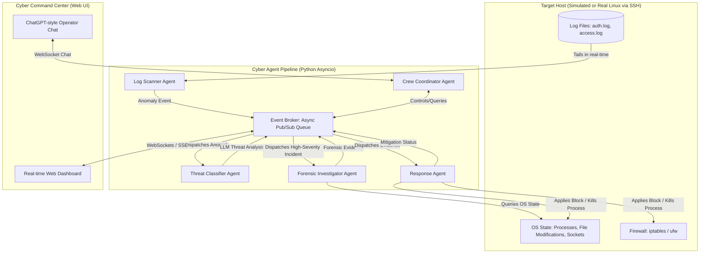

# SentinelFlow 🛡️

**SentinelFlow** is an asynchronous, event-driven multi-agent incident response system designed to detect, classify, investigate, and mitigate server threats in real-time. It reduces threat resolution times (MTTR) from hours to seconds by employing a crew of specialized autonomous agents.

The project features a premium cyberpunk-themed **Cyber Command Center** dashboard equipped with collapsible panels, a ChatGPT-like operator console, and Windows Snap-style layout configurations.

---

## 🚀 Key Features

* **Multi-Agent Orchestration**: Five specialized agents (Log Scanner, Threat Classifier, Forensic Investigator, Response Agent, and Coordinator) collaborating asynchronously.
* **Decoupled Architecture**: Built around an in-memory Pub/Sub Event Broker that keeps agents isolated, ensuring threat spikes never block log tailing.
* **Flexible Target Adapters**: Runs in **Simulation Mode** (for quick local demos) or **Live SSH Mode** (remotely securing a real Linux VPS or local WSL2 container).
* **Robust Safety Nets & Fallbacks**: 
  - LLM timeouts/quota limits automatically fall back to rule-based heuristics.
  - SSH blocking commands fallback from UFW rules to raw IPTables.
  - Web shell uploads fallback from quarantining to direct deletion.
* **Cyber Command Center**: A styled UI supporting collapsible column grids, active selection layouts, live agent state SVG mapping, and horizontal scrollable markdown tables inside the chat console.

---

## 📊 System Architecture



---

## 🛠️ The Agent Crew

1. **📟 Log Scanner Agent**: Tails access and authentication logs in real-time, instantly raising alerts when signatures match brute-force or injection anomalies.
2. **🧠 Threat Classifier Agent**: Utilizes Google Gemini LLM API (enforcing strict Pydantic schemas) to analyze attack vectors, grading threat severity and confidence.
3. **🕵️‍♂️ Forensic Investigator Agent**: Connects via SSH to query active system socket states, file changes, and running process statistics.
4. **🚫 Response Agent**: Automatically enforces firewall drops (`ufw deny`), kills malicious process PIDs, and quarantines web shells.
5. **🤖 Crew Coordinator Agent**: Bridges the administrator directly to the agent queue via a chat console, executing commands (e.g. *status*, *unblock <IP>*, *show processes*) written in natural language.

---

## 📦 Getting Started

### 1. Installation
1. Clone the repository:
   ```bash
   git clone https://github.com/RamvikasSV/SentinelFlow.git
   cd SentinelFlow
   ```
2. Create and activate a Python virtual environment:
   ```bash
   python -m venv venv
   .\venv\Scripts\activate   # Windows
   source venv/bin/activate  # macOS/Linux
   ```
3. Install the dependencies:
   ```bash
   pip install -r requirements.txt
   ```

### 2. Configure Environment `.env`
Create a `.env` file in the root directory:
```ini
SYSTEM_MODE=simulation          # 'simulation' or 'ssh'
GEMINI_API_KEY=your_gemini_api_key_here

# Required only if SYSTEM_MODE=ssh
SSH_HOST=127.0.0.1
SSH_PORT=22
SSH_USERNAME=your_username
SSH_PASSWORD=your_password
SSH_KEY_PATH=
```

### 3. Run the Platform
1. Launch the FastAPI server:
   ```bash
   uvicorn backend.main:app --host 127.0.0.1 --port 8000
   ```
2. Open your web browser and navigate to:
   [http://localhost:8000](http://localhost:8000)

---

## 📂 Documentation

Detailed setup guides, testing scenarios, and design specifications are stored inside the `/docs` folder:
* **[Technical Architecture & Build Guide](docs/PROJECT_GUIDE.md)**: Deep dive into Pub/Sub patterns, structured schemas, and adapter rationale.
* **[User Setup & Walkthrough Guide](docs/walkthrough.md)**: Includes manual test steps for simulations (SSH brute force, web shell upload) and how to configure a **local WSL2 sandbox** without a credit card.
